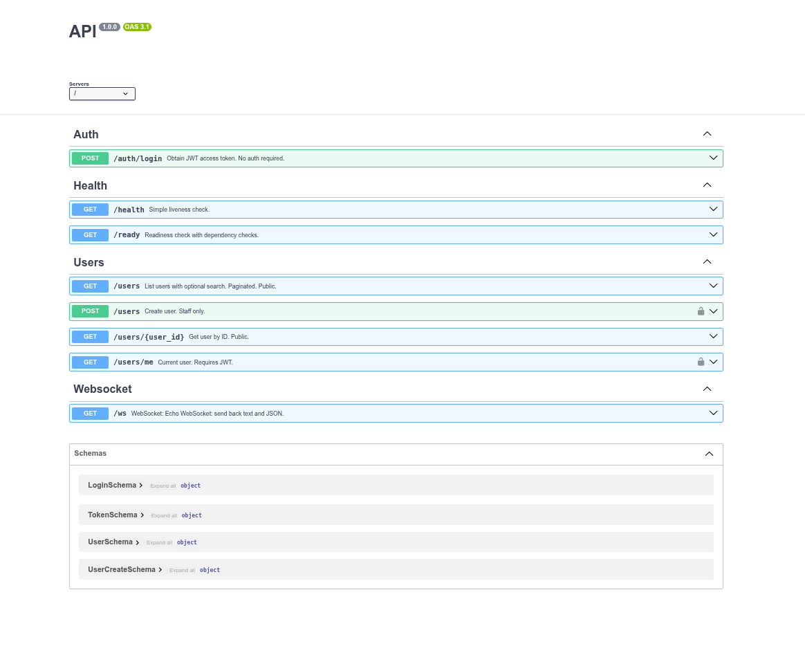

<p align="center">
  <a href="https://www.djangoproject.com/" target="_blank">
    
  </a>
  <a href="https://github.com/FarhanAliRaza/django-bolt" target="_blank">
    
  </a>
  <a href="https://www.python.org/" target="_blank">
    
  </a>
  <a href="https://github.com/Matnazar-Matnazarov/django-bolt-test/blob/main/LICENSE" target="_blank">
    
  </a>
</p>

<h1 align="center">Django Bolt Test</h1>

<p align="center">
  <strong>High-performance REST API</strong> built with <a href="https://github.com/FarhanAliRaza/django-bolt">Django Bolt</a> — async Python API framework on top of Django.
</p>

<p align="center">
  JWT · Pagination · Search · Health checks · WebSocket · OpenAPI/Swagger · Tests
</p>

---

## Features

| Area | Description |
|------|-------------|
| **Auth** | JWT via `POST /auth/login`; `GET /users/me` and `POST /users` require JWT |
| **Health** | `GET /health` (liveness), `GET /ready` (readiness + DB) |
| **Users** | List (paginated, `?search=`), get by ID, current user, create (staff only) |
| **Pagination** | `GET /users?page=1&page_size=10` (page-number) |
| **Permissions** | `AllowAny` (list, get), `IsAuthenticated` + `IsStaff` (create user) |
| **WebSocket** | `WS /ws` echo (text + JSON) |
| **Observability** | `X-Server-Time`, `X-Response-Time` on every response |
| **Docs** | OpenAPI/Swagger at `/docs`, Django Admin at `/admin/` |

---

## Tech Stack

| Technology | Role |
|------------|------|
| [Python](https://www.python.org/) 3.13+ | Runtime |
| [Django](https://www.djangoproject.com/) 6.x | Web framework |
| [Django Bolt](https://github.com/FarhanAliRaza/django-bolt) 0.5.x | Async API layer |
| [msgspec](https://github.com/jcrist/msgspec) | Schemas & serialization |
| [pytest](https://pytest.org/) | Testing (unit + integration) |
| [uv](https://github.com/astral-sh/uv) | Dependency management |

---

## Project Structure

```
django-bolt-test/
├── api/                      # Bolt API package
│   ├── __init__.py            # BoltAPI instance, middleware, register routes
│   ├── middleware.py          # X-Server-Time, X-Response-Time
│   └── routes/
│       ├── __init__.py        # register_all_routes(api)
│       ├── health.py          # /health, /ready
│       ├── auth.py            # POST /auth/login
│       ├── users.py           # GET/POST /users, /users/me
│       └── websocket.py       # WS /ws
├── config/                    # Django project
│   ├── api.py                 # Re-export: from api import api
│   ├── settings.py
│   └── urls.py                # admin only
├── accounts/                  # Django app
│   ├── schemas.py             # UserSchema, LoginSchema, TokenSchema, UserCreateSchema
│   ├── admin.py
│   └── models.py
├── tests/
│   ├── conftest.py            # require_server fixture
│   ├── test_health.py
│   ├── test_auth.py
│   ├── test_users.py
│   ├── test_websocket.py
│   └── test_schemas.py
├── manage.py
├── pyproject.toml
└── requirements.txt
```

---

## Prerequisites

- **Python** 3.13+
- **[uv](https://github.com/astral-sh/uv)** (recommended) or pip

---

## Installation

```bash
git clone https://github.com/Matnazar-Matnazarov/django-bolt-test.git
cd django-bolt-test

uv venv
uv sync
# or: pip install -r requirements.txt
```

---

## Database

```bash
uv run manage.py migrate
uv run manage.py createsuperuser   # for admin & JWT login
```

---

## Run

```bash
uv run manage.py runbolt --dev --host localhost --port 8000
```

| Resource | URL |
|----------|-----|
| API | http://localhost:8000 |
| Swagger | http://localhost:8000/docs |
| Admin | http://localhost:8000/admin/ |

---

## API Documentation (Swagger)

Interactive OpenAPI docs at `/docs` — Auth, Health, Users, WebSocket endpoints and schemas (LoginSchema, TokenSchema, UserSchema, UserCreateSchema).

<p align="center">
  
</p>

*Screenshot: Swagger UI at http://localhost:8000/docs*

---

## API Endpoints

| Method | Path | Description | Auth |
|--------|------|-------------|------|
| GET | `/health` | Liveness | — |
| GET | `/ready` | Readiness (DB + checks) | — |
| POST | `/auth/login` | JWT token (body: `username`, `password`) | — |
| GET | `/users` | List users (paginated, `?search=`) | — |
| GET | `/users/{id}` | Get user by ID | — |
| GET | `/users/me` | Current user | JWT |
| POST | `/users` | Create user (staff only) | JWT + Staff |
| WS | `/ws` | Echo WebSocket | — |

- **Response headers** (all): `X-Server-Time`, `X-Response-Time`.
- **JWT:** `Authorization: Bearer <access_token>`.

---

## Testing

Tests are written with **[pytest](https://pytest.org/)** (unit and integration). Unit tests need no server; integration tests call the live API and skip automatically if the server is not running (`require_server` fixture).

| Type | Command | Notes |
|------|---------|--------|
| **Unit** | `uv run pytest tests/test_schemas.py -v` | No server; schemas only |
| **Integration** | `uv run pytest tests/ -v -m integration` | Start server first |
| **All** | `uv run pytest tests/ -v` | Unit runs; integration skips if server down |

**Stack:** pytest, pytest-django, pytest-asyncio, httpx, websockets. Install dev deps: `uv sync --extra dev`.

---

## Settings (optional)

In `config/settings.py`:

| Setting | Default |
|---------|---------|
| `BOLT_JWT_SECRET` | `SECRET_KEY` |
| `BOLT_JWT_ALGORITHM` | `"HS256"` |
| `BOLT_JWT_EXPIRES_SECONDS` | `3600` |

---

## License

See [LICENSE](LICENSE).
